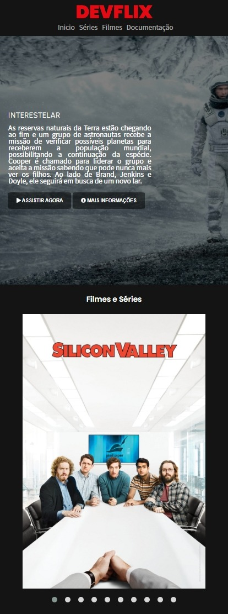
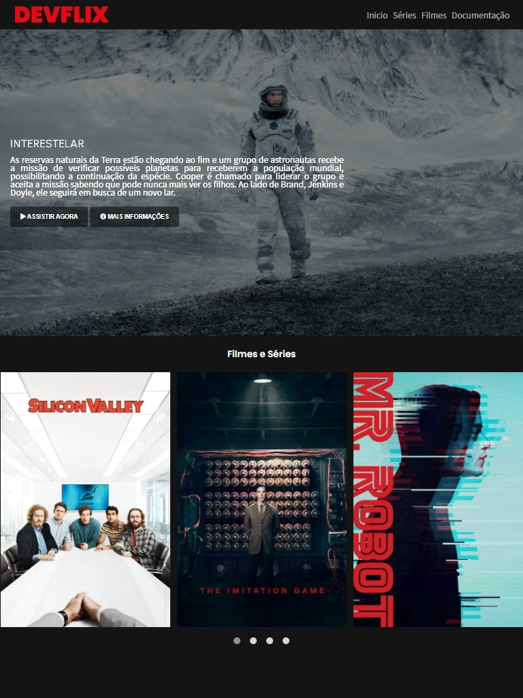
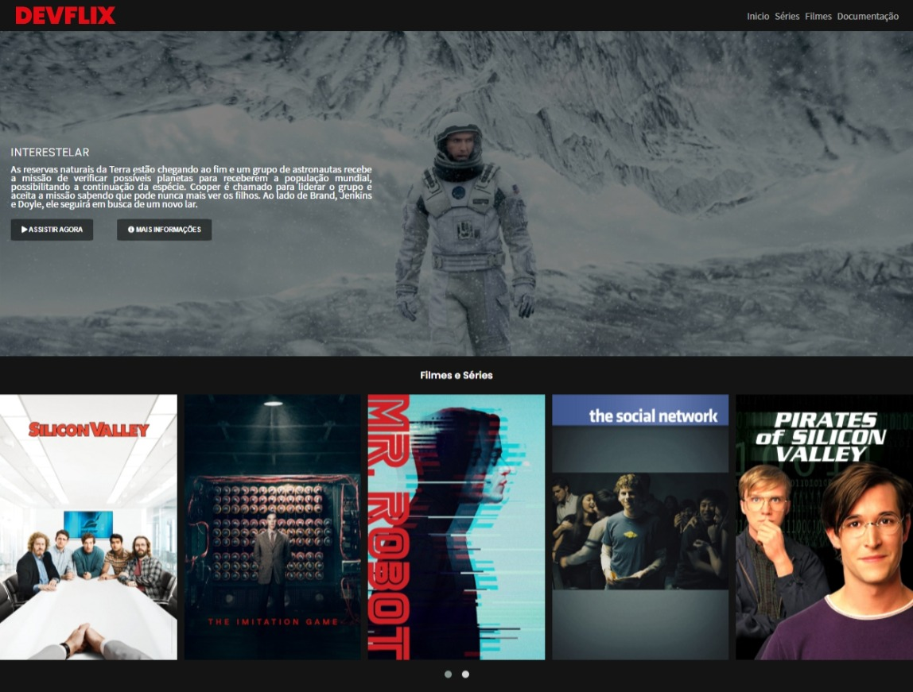

<h2>DevFlix</h2>

<section>
  
  <h3 align="center">Versão mobile</h3>
  <p align="center">  </p>
  
</section>

<section>
  
  <h3 align="center">Versão tablet</h3>
  <p align="center">  </p>
  
</section>

<section>
  
  <h3 align="center">Versão desktop</h3>
  <p align="center">  </p>  
  
</section>

<h2>Sobre</h2>

<h4>"Um projeto com base em um curso de um bootcamp da Digital Innovation One."</h4>

<h2>Motivo</h2>

<p>Iniciei esse projeto por causa de um curso que estava fazendo, porém decidi cria-lo com uma roupagem nova e autoral, o deixando do jeito que almejava, praticando tudo que aprendi.</p>

<h2>Objetivos</h2>

<ol>
    <li>O site tem a função de ser um clone da Netflix, porém com a roupagem de DevFlix, um streaming para dev's</li>
    <li>O site pode ser aberto nas principais telas do mercado: mobile, tablet e desktop</li>
</ol>

<h2>Funcionalidades</h2>

<ul>
    <li>Na página do cadastro é necessário que você preencha os campos obrigatórios para ser redirecionado para a página de login</li>
    <li>Na página de login, você só poderá entrar usando o email e senha válidos, por conta do sistema de validação</li>
    <li>Passando o mouse sobre os itens do menu de navegação, os mesmos mudam de cor.</li>
    <li>Clicando em "Assistir Agora" você é direcionado para o trailer de Interestelar.</li>
    <li>Para navegar pelo carrossel de filmes, você pode utilizar o a rolagem lateral com o mouse ou clicando nas bolinhas abaixo do carrossel.</li>
    <li>Ao clicar em qualquer um dos filmes presentes no carrossel, você será redirecionado para o trailer oficial do filme no youtube.</li>
</ul>

<h2>Instalação</h2>
  
<h5>$ git clone https://github.com/lucassoteroo/DevFlix.git</h5> 

<h2>Contrução</h2>


<h2>Rodar Projeto</h2>
- Executar o comando:
  
````npm install````
